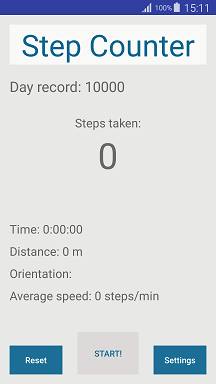

# StepCounter
Simple pedometer application using Android step detector, accelerometer and magnetometer sensors.

Step counter sensor was also tried but step detector turned out to work better in this case.

Device used for testing: Samsung Galaxy S5 running on Android Lollipop 5.0 (API level 21).

Min. SDK version supported: 19 (KitKat).

